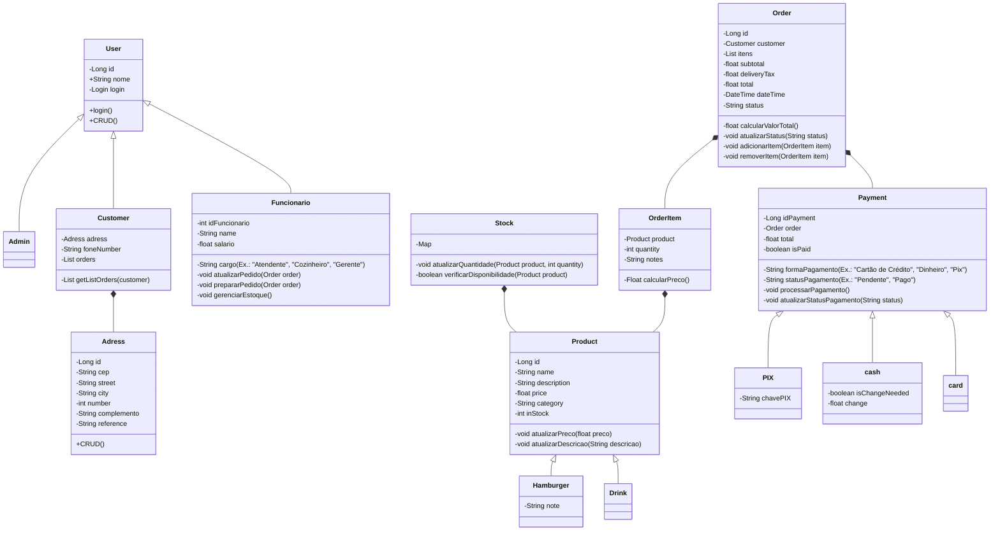

```mermaid
classDiagram
    class User{
        -Long id
        +String nome
        -Login login
        +login()
        +CRUD()
    }
    
    class Admin{
    }
    
    class Customer{
        -Adress adress
        -String foneNumber
        -List<Order> orders
        -List<Order> getListOrders(customer)
    }
    
    class Funcionario{
        -int idFuncionario
        -String name
        -String cargo (Ex.: "Atendente", "Cozinheiro", "Gerente")
        -float salario
        -void atualizarPedido(Order order)
        -void prepararPedido(Order order)
        -void gerenciarEstoque()
    }
    
    class Adress{
        -Long id
        -String cep
        -String street
        -String city
        -int number
        -String complemento
        -String reference
        +CRUD()
    }

    class Stock{
        -Map<Product, int>
        -void atualizarQuantidade(Product product, int quantity)
        -boolean verificarDisponibilidade(Product product)
    }
    
    class Product{
        -Long id
        -String name
        -String description
        -float price
        -String category
        -int inStock
        -void atualizarPreco(float preco)
        -void atualizarDescricao(String descricao)
    }
    
    class Hamburger{
        -String note
    }
    
    class Drink{
    }

    class Order{
        -Long id
        -Customer customer
        -List<orderItem> itens
        -float subtotal
        -float deliveryTax
        -float total
        -DateTime dateTime
        -String status
        -float calcularValorTotal()
        -void atualizarStatus(String status)
        -void adicionarItem(OrderItem item)
        -void removerItem(OrderItem item)
    }

    class OrderItem{
     -Product product
     -int quantity
     -String notes
     -Float calcularPreco()
    }

    class Payment{
        -Long idPayment
        -Order order
        -float total
        -boolean isPaid
    
        -String formaPagamento (Ex.: "Cartão de Crédito", "Dinheiro", "Pix")
        -String statusPagamento (Ex.: "Pendente", "Pago")

        -void processarPagamento()
        -void atualizarStatusPagamento(String status)
    }
    
    class PIX{
        -String chavePIX
    }
    
    class cash{
        -boolean isChangeNeeded
        -float change
    }
    
    class card{
    }
    
    User <|-- Admin
    User <|-- Customer
    User <|-- Funcionario

    Customer *-- Adress

    Order *-- OrderItem
    Order *-- Payment

    Stock *-- Product

    OrderItem *-- Product

    Product <|-- Hamburger
    Product <|-- Drink

    Payment <|-- PIX
    Payment <|-- cash
    Payment <|-- card
```