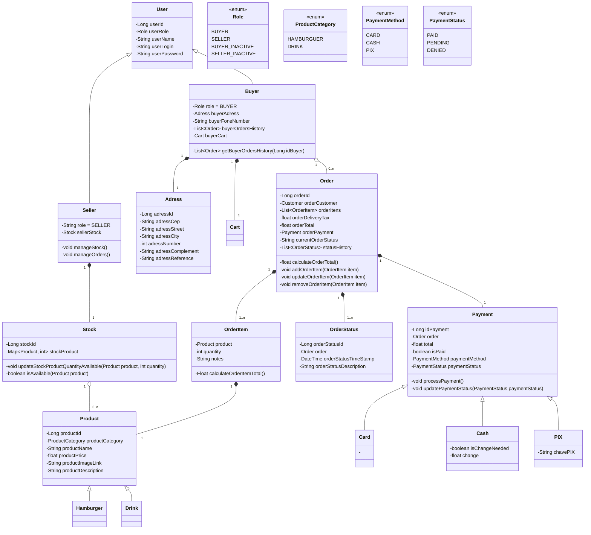

```mermaid
classDiagram
    class User{
        -Long userId
        -Role userRole
        -String userName
        -String userLogin
        -String userPassword
    }

    class Role{
        <<enum>>
        BUYER
        SELLER
        BUYER_INACTIVE
        SELLER_INACTIVE
    }

    class Seller{
        -String role = SELLER
        -Stock sellerStock
        -void manageStock()
        -void manageOrders()
    }    

    class Buyer{
        -Role role = BUYER
        -Adress buyerAdress
        -String buyerFoneNumber
        -List~Order~ buyerOrdersHistory
        -Cart buyerCart
        -List~Order~ getBuyerOrdersHistory(Long idBuyer)
    }

    class Adress{
        -Long adressId
        -String adressCep
        -String adressStreet
        -String adressCity
        -int adressNumber
        -String adressComplement
        -String adressReference
    }    

    class Product{
        -Long productId
        -ProductCategory productCategory
        -String productName
        -float productPrice
        -String productImageLink
        -String productDescription
    }

    class ProductCategory{
        <<enum>>
        HAMBURGUER
        DRINK
    }

    class Hamburger{
    }

    class Drink{
    }
    
    class Stock{
        -Long stockId
        -Map~Product, int~ stockProduct
        -void updateStockProductQuantityAvailable(Product product, int quantity)
        -boolean isAvailable(Product product)
    }

    class Cart{
    }

    class OrderItem{
        -Product product
        -int quantity
        -String notes
        -Float calculateOrderItemTotal()
    }

    class OrderStatus{
        -Long orderStatusId
        -Order order
        -DateTime orderStatusTimeStamp
        -String orderStatusDescription
    }

    class Order{
        -Long orderId
        -Customer orderCustomer
        -List~OrderItem~ orderItens
        -float orderDeliveryTax
        -float orderTotal
        -Payment orderPayment
        -String currentOrderStatus
        -List~OrderStatus~ statusHistory
        -float calculateOrderTotal()
        -void addOrderItem(OrderItem item)
        -void updateOrderItem(OrderItem item)
        -void removeOrderItem(OrderItem item)
    }
    
    class Payment{
        -Long idPayment
        -Order order
        -float total
        -boolean isPaid
        -PaymentMethod paymentMethod
        -PaymentStatus paymentStatus
        -void processPayment()
        -void updatePaymentStatus(PaymentStatus paymentStatus)
    }

    class PaymentMethod{
        <<enum>>
        CARD
        CASH
        PIX
    }

    class PaymentStatus{
        <<enum>>
        PAID
        PENDING
        DENIED
    }

    class Card{
        -
    }

    class Cash{
        -boolean isChangeNeeded
        -float change
    }

    class PIX{
        -String chavePIX
    }

    User <|-- Buyer
    User <|-- Seller
    Buyer "1" *-- "1" Adress
    Buyer "1" *-- "1" Cart
    Buyer "1" o-- "0..n" Order
    Seller "1" *-- "1" Stock
    Stock "1" o-- "0..n" Product
    Product <|-- Hamburger
    Product <|-- Drink
    Order "1" *-- "1..n" OrderItem
    OrderItem "1" *-- "1" Product
    Order "1" *-- "1..n" OrderStatus    
    Order "1" *-- "1" Payment
    Payment <|-- Card
    Payment <|-- Cash
    Payment <|-- PIX
```
